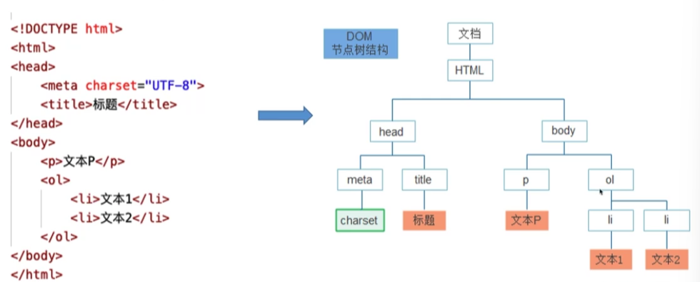

# 前端开发学习笔记

by K.

## 1. HTML

### 1. HTML列表

HTML 支持有序、无序和定义列表

#### 1.1 无序列表

无序列表是一个项目的列表，此列项目使用粗体圆点（典型的小黑圆圈）进行标记。

无序列表使用 \<ul> 标签

```html
<ul>
<li>Coffee</li>
<li>Milk</li>
</ul>
```

浏览器显示如下：

<ul>
<li>Coffee</li>
<li>Milk</li>
</ul>
#### 1.2 有序列表

同样，有序列表也是一列项目，列表项目使用数字进行标记。 有序列表始于 <ol> 标签。每个列表项始于 <li> 标签。

列表项使用数字来标记。

```html
<ol>
<li>Coffee</li>
<li>Milk</li>
</ol>
```

<ol>
<li>Coffee</li>
<li>Milk</li>
</ol>


#### 1.3 自定义列表

自定义列表不仅仅是一列项目，而是项目及其注释的组合。

自定义列表以 \<dl> 标签开始。每个自定义列表项以 \<dt> 开始。每个自定义列表项的定义以 \<dd> 开始。

```html
<dl>
<dt>Coffee</dt>
<dd>- black hot drink</dd>
<dt>Milk</dt>
<dd>- white cold drink</dd>
</dl>
```

<dl>
<dt>Coffee</dt>
<dd>- black hot drink</dd>
<dt>Milk</dt>
<dd>- white cold drink</dd>
</dl>

### 2. HTML 表格

表格由 \<table> 标签来定义。每个表格均有若干行（由 \<tr> 标签定义），每行被分割为若干单元格（由\<td> 标签定义）。字母 td 指表格数据（table data），即数据单元格的内容。数据单元格可以包含文本、图片、列表、段落、表单、水平线、表格等等。

#### 2.1 表格实例

```HTML
<table border="1">
    <tr>
        <td>row 1, cell 1</td>
        <td>row 1, cell 2</td>
    </tr>
    <tr>
        <td>row 2, cell 1</td>
        <td>row 2, cell 2</td>
    </tr>
</table>
```

<table border="1">
    <tr>
        <td>row 1, cell 1</td>
        <td>row 1, cell 2</td>
    </tr>
    <tr>
        <td>row 2, cell 1</td>
        <td>row 2, cell 2</td>
    </tr>
</table>


#### 2.2 表格表头

表格的表头使用 \<th> 标签进行定义。

大多数浏览器会把表头显示为粗体居中的文本：

```HTML
<table border="1">
    <tr>
        <th>Header 1</th>
        <th>Header 2</th>
    </tr>
    <tr>
        <td>row 1, cell 1</td>
        <td>row 1, cell 2</td>
    </tr>
    <tr>
        <td>row 2, cell 1</td>
        <td>row 2, cell 2</td>
    </tr>
</table>
```

<table border="1">
    <tr>
        <th>Header 1</th>
        <th>Header 2</th>
    </tr>
    <tr>
        <td>row 1, cell 1</td>
        <td>row 1, cell 2</td>
    </tr>
    <tr>
        <td>row 2, cell 1</td>
        <td>row 2, cell 2</td>
    </tr>
</table>


### 3. 文本格式化

HTML 使用标签 \<b>("bold") 与 \<i>("italic") 对输出的文本进行格式, 如：**粗体** or *斜体*。这些HTML标签被称为格式化标签

#### 3.1 格式化标签

| 标签      | 描述         |
| :-------- | :----------- |
| \<b>      | 定义粗体文本 |
| \<em>     | 定义着重文字 |
| \<i>      | 定义斜体字   |
| \<small>  | 定义小号字   |
| \<strong> | 定义加重语气 |
| \<sub>    | 定义下标字   |
| \<sup>    | 定义上标字   |
| \<ins>    | 定义插入字   |
| \<del>    | 定义删除字   |

#### 3.2 HTML 引文, 引用, 及标签定义

| 标签          | 描述               |
| :------------ | :----------------- |
| \<abbr>       | 定义缩写           |
| \<address>    | 定义地址           |
| \<bdo>        | 定义文字方向       |
| \<blockquote> | 定义长的引用       |
| \<q>          | 定义短的引用语     |
| \<cite>       | 定义引用、引证     |
| \<dfn>        | 定义一个定义项目。 |

### 4. HTML\<head>

\<head> 元素包含了所有的头部标签元素。在 \<head>元素中你可以插入脚本（scripts）, 样式文件（CSS），及各种meta信息。

可以添加在头部区域的元素标签为: \<title>, \<style>, \<meta>, \<link>, \<script>, \<noscript> 和 \<base>。

#### 4.1 HTML\<title>元素

\<title> 标签定义了不同文档的标题。

\<title> 在 HTML/XHTML 文档中是必须的。

\<title> 元素:

- 定义了浏览器工具栏的标题
- 当网页添加到收藏夹时，显示在收藏夹中的标题
- 显示在搜索引擎结果页面的标题

#### 4.2 HTML\<base>元素

<base> 标签描述了基本的链接地址/链接目标，该标签作为HTML文档中所有的链接标签的默认链接:
```HTML
<head>
<base href="http://www.runoob.com/images/" target="_blank">
</head>
```

#### 4.3 HTML\<link>元素

\<link> 标签定义了文档与外部资源之间的关系。

\<link> 标签通常用于链接到样式表:

```HTML
<head>
<link rel="stylesheet" type="text/css" href="mystyle.css">
</head>
```

#### 4.4 HTML\<meta>元素

meta标签描述了一些基本的元数据。

\<meta> 标签提供了元数据.元数据也不显示在页面上，但会被浏览器解析。

META 元素通常用于指定网页的描述，关键词，文件的最后修改时间，作者，和其他元数据。

元数据可以使用于浏览器（如何显示内容或重新加载页面），搜索引擎（关键词），或其他Web服务。

为搜索引擎定义关键词:

```HTML
<meta name="keywords" content="HTML, CSS, XML, XHTML, JavaScript">
```

为网页定义描述内容:

```HTML
<meta name="description" content="免费 Web & 编程 教程">
```

定义网页作者:

```HTML
<meta name="author" content="Runoob">
```

每30秒钟刷新当前页面:

```HTML
<meta http-equiv="refresh" content="30">
```

### 5. *HTML 语义化

#### 5.1 什么是HTML语义化

HTML语义化是指在用标签构建HTML页面时避免大篇幅地使用无语义的标签。

选择合适的标签（代码语义化）便于开发者阅读和写出更优雅的代码的同时让浏览器的爬虫和机器很好的解析。

#### 5.2 为什么要语义化

1. 有利于SEO，搜索引擎根据标签确定上下文和各个关键字的权重。
2. 利于用户阅读，样式文件未加载时页面结构清晰。
3. 利于屏幕阅读器解析，如盲人阅读器会根据语义渲染网页。
4. 利于开发和维护，减少差异化，代码更具可读性、更易于维护。
5. 在没有CSS的情况下，页面也能呈现出很好的内容结构和代码结构。

#### 5.3 如何语义化

1. 尽可能少的使用无语义的标签div和span
2. 在语义不明显时，既可以使用div或者p时，尽量用p，因为p在默认情况下有上下间距，对兼容特殊终端有利
3. 不要使用纯样式标签，如：b、font、u等，改用CSS设置
4. 需要强调的文本，可以包含在strong或者em标签中（浏览器预设样式，能用css指定就不用他们），strong默认样式是加粗（不要用b），em是斜体（不用i）
5. 使用表格时，标题要用caption，表头用thead，主体部分用tbody包围，尾部用tfoot包围。表头和单元格要区分开，表头用th，单元格用td
6. 表单域要用fieldset标签抱起来，并用legend标签说明表单的用途
7. 每个input标签对应的说明文本都需要使用label标签，并且通过为input设置id属性，在label标签中设置for=someId来让说明文本和相对应的input关联起来
   

### 6. *从浏览器地址栏输入 url 到请求返回发生了什么

1. 输入 URL 后解析出协议、主机、端口、路径等信息，并构造一个 HTTP 请求。
   1. 强缓存。
   2. 协商缓存。
2. DNS 域名解析。（[字节面试被虐后，是时候搞懂 DNS 了](https://juejin.cn/post/6990344840181940261)）
3. TCP 连接。
4. http 请求。
5. 服务器处理请求并返回 HTTP 报文。
6. 浏览器渲染页面。
7. 断开 TCP 连接。

#### 6.1 三次握手

为什么需要三次握手，两次不行吗？其实这是由 TCP 的自身特点**可靠传输**决定的。客户端和服务端要进行可靠传输，那么就需要**确认双方的接收和发送能力**。第一次握手可以确认客服端的**发送能力**，第二次握手，确认了服务端的**发送能力和接收能力**，所以第三次握手才可以确认客户端的**接收能力**。不然容易出现丢包的现象。

## 2. CSS

### 1. id和class选择器

如果你要在HTML元素中设置CSS样式，你需要在元素中设置"id" 和 "class"选择器

#### 1.1 id选择器

id 选择器可以为标有特定 id 的 HTML 元素指定特定的样式。

HTML元素以id属性来设置id选择器,CSS 中 id 选择器以 "#" 来定义。

#### 1.2 class选择器

class 选择器用于描述一组元素的样式，class 选择器有别于id选择器，class可以在多个元素中使用。

class 选择器在 HTML 中以 class 属性表示, 在 CSS 中，类选择器以一个点 **.** 号显示

#### 1.3 组合选择符

 CSS3 中包含了四种组合方式:

- 后代选择器(以空格   分隔)
- 子元素选择器(以大于 **>** 号分隔）
- 相邻兄弟选择器（以加号 **+** 分隔）
- 普通兄弟选择器（以波浪号 **～** 分隔）

##### 1.3.1 后代选择器

后代选择器用于选取某元素的**后代**元素。

以下实例选取所有 \<p> 元素插入到 \<div> 元素中: 

```css
div p
{
  background-color:yellow;
}
```

##### 1.3.2 子元素选择器

与后代选择器相比，子元素选择器（Child selectors）只能选择作为某元素**直接/一级**子元素的元素。

以下实例选择了\<div>元素中所有直接子元素 \<p> ：

```css
div>p
{
  background-color:yellow;
}
```

##### 1.3.3 相邻兄弟选择器

相邻兄弟选择器（Adjacent sibling selector）可选择**紧接在另一元素后**的元素，且二者有**相同父元素**。

如果需要选择紧接在另一个元素后的元素，而且二者有相同的父元素，可以使用相邻兄弟选择器（Adjacent sibling selector）。

以下实例选取了所有位于 \<div> 元素后的第一个 \<p> 元素:

```css
div+p
{
  background-color:yellow;
}
```

##### 1.3.4 后续兄弟选择器

后续兄弟选择器选取**所有指定元素之后的相邻兄弟元素**。

以下实例选取了所有 \<div> 元素之后的所有相邻兄弟元素 \<p> : 

```css
div~p
{
  background-color:yellow;
}
```

#### 1.4 嵌套选择器

它可能适用于选择器内部的选择器的样式。

在下面的例子设置了四个样式：

- **p{ }**: 为所有 **p** 元素指定一个样式。
- **.marked{ }**: 为所有 **class="marked"** 的元素指定一个样式。
- **.marked p{ }**: 为所有 **class="marked"** 元素内的 **p** 元素指定一个样式。
- **p.marked{ }**: 为所有 **class="marked"** 的 **p** 元素指定一个样式。

### 2. 盒子模型

CSS3 中的盒模型有以下两种：**标准盒模型**、**IE（替代）盒模型**

两种盒子模型都是由 `content + padding + border + margin` 构成，其大小都是由 `content + padding + border` 决定的，但是盒子内容宽/高度（即 `width/height`）的计算范围根据盒模型的不同会有所不同：

- 标准盒模型：只包含 `content` 。
- IE（替代）盒模型：`content + padding + border` 。

CSS盒模型本质上是一个盒子，封装周围的HTML元素，它包括：边距，边框，填充，和实际内容。


- **Margin(外边距)** - 清除边框外的区域，外边距是透明的。
- **Border(边框)** - 围绕在内边距和内容外的边框。
- **Padding(内边距)** - 清除内容周围的区域，内边距是透明的。
- **Content(内容)** - 盒子的内容，显示文本和图像。

### 3. 定位

position 属性指定了元素的定位类型。

**没有position，设置top、left、bottom、right值都没有效**

position 属性的五个值：

- [static](https://www.runoob.com/css/css-positioning.html#position-static)
- [relative](https://www.runoob.com/css/css-positioning.html#position-relative)
- [fixed](https://www.runoob.com/css/css-positioning.html#position-fixed)
- [absolute](https://www.runoob.com/css/css-positioning.html#position-absolute)
- [sticky](https://www.runoob.com/css/css-positioning.html#position-sticky)

元素可以使用的顶部，底部，左侧和右侧属性定位。然而，这些属性无法工作，除非是先设定position属性。他们也有不同的工作方式，这取决于定位方法。

#### 3.1 static定位

HTML 元素的默认值，即没有定位，遵循正常的文档流对象。

静态定位的元素不会受到 top, bottom, left, right影响。

#### 3.2 fixed定位

元素的位置相对于浏览器窗口是固定位置。

即使窗口是滚动的它也不会移动

#### 3.3 relative定位

相对定位元素的定位是相对其正常位置。

```css
h2.pos_left
{
    position:relative;
    left:-20px;
}
h2.pos_right
{
    position:relative;
    left:20px;
}
```

#### 3.4 absolute定位

绝对定位的元素的位置相对于最近的已定位（设置了相对或绝对定位）的父元素，如果元素没有已定位的父元素，那么它的位置相对于\<html>

**元素会脱离文档流，如果设置偏移量，会影响其他元素的位置定位**

#### 3.5 sticky定位

sticky 英文字面意思是粘，粘贴，所以可以把它称之为粘性定位。

`position: sticky;` 基于用户的滚动位置来定位。

粘性定位的元素是依赖于用户的滚动，在 `position:relative` 与 `position:fixed` 定位之间切换。

它的行为就像 `position:relative;` 而当页面滚动超出目标区域时，它的表现就像 `position:fixed;`，它会固定在目标位置。

```css
div.sticky {
    position: -webkit-sticky; /* Safari */
    position: sticky;
    top: 0;
    background-color: green;
    border: 2px solid #4CAF50;
}
```

### 4. 水平 & 垂直对齐

#### 4.1 元素居中对齐

要水平居中对齐一个元素(如 \<div>), 可以使用 `margin: auto;`。

**注意:** 如果没有设置 **width** 属性(或者设置 100%)，居中对齐将不起作用。

#### 4.2 文本居中对齐

如果仅仅是为了文本在元素内居中对齐，可以使用 `text-align: center;`

#### 4.3 图片居中对齐

要让图片居中对齐, 可以使用 `margin: auto;` 并将它放到 **块** 元素中

#### 4.4 左右对齐
/////
##### 4.4.1 定位方式

```css
.right {
    position: absolute;
    right: 0px;
    width: 300px;
    border: 3px solid #73AD21;
    padding: 10px;
}
```

注释：绝对定位元素会被从正常流中删除，并且能够交叠元素。

**提示:** 当使用 **position** 来对齐元素时, 通常 \<body> 元素会设置 **margin** 和 **padding** 。 这样可以避免在不同的浏览器中出现可见的差异。

##### 4.4.2 float方式

```css
.right {
    float: right;
    width: 300px;
    border: 3px solid #73AD21;
    padding: 10px;
}
```

当像这样对齐元素时，对 \<body> 元素的外边距和内边距进行预定义是一个好主意。这样可以避免在不同的浏览器中出现可见的差异。

*注意：如果子元素的高度大于父元素，且子元素设置了浮动，那么子元素将溢出，这时候你可以使用 "***clearfix**(清除浮动)" 来解决该问题。

我们可以在父元素上添加 overflow: auto; 来解决子元素溢出的问题:

```css
.clearfix {
    overflow: auto;
}
```

#### 4.5 垂直居中对齐

##### 4.5.1 使用padding

CSS 中有很多方式可以实现垂直居中对齐。 一个简单的方式就是头部顶部使用 **padding**:

```css
.center {
    padding: 70px 0;
    border: 3px solid green;
}
```

如果要水平和垂直都居中，可以使用 **padding** 和 **text-align: center**

```css
.center {
    padding: 70px 0;
    border: 3px solid green;
    text-align: center;
}
```

##### 4.5.2 使用 line-height

```css
.center {
    line-height: 200px;
    height: 200px;
    border: 3px solid green;
    text-align: center;
}
 
/* 如果文本有多行，添加以下代码: */
.center p {
    line-height: 1.5;
    display: inline-block;
    vertical-align: middle;
}
```

##### 4.5.3 使用position和transform

```css
.center { 
    height: 200px;
    position: relative;
    border: 3px solid green; 
}
 
.center p {
    margin: 0;
    position: absolute;
    top: 50%;
    left: 50%;
    transform: translate(-50%, -50%);
}
```

### 5. 块格式化上下文BFC

块格式化上下文（**Block Formatting Context，BFC**）是Web页面的可视化CSS渲染的部分，是块级盒布局发生的区域，也是浮动元素与其他元素交互的区域 。有这几种框会为其内容创建新的块格式化上下文：浮动框、绝对定位框、非块框的块容器（例如inline-blocks、table-cells和table-captions）、“overflow”属性非“visible”的块框（除非这个值已扩散到整个视口）。

#### 5.1 特性

1. 块级元素会在垂直方向一个接一个的排列，和文档流的排列方式一致。
2. 在 BFC 中上下相邻的两个容器的 `margin` 会重叠，创建新的 BFC 可以避免外边距重叠。
3. 计算 BFC 的高度时，需要计算**浮动元素**的高度。
4. BFC 区域**不会与浮动的容器发生重叠**。
5. BFC 是独立的容器，容器内部元素不会影响外部元素。
6. 每个元素的左 `margin` 值和容器的左 `border` 相接触。

### 6. 浏览器的渲染过程


浏览器渲染过程如下：

1. 解析HTML，生成DOM树，解析CSS，生成CSSOM树
2. 将DOM树和CSSOM树结合，生成渲染树(Render Tree)
3. Layout(回流):根据生成的渲染树，进行回流(Layout)，得到节点的几何信息（位置，大小）
4. Painting(重绘):根据渲染树以及回流得到的几何信息，得到节点的绝对像素
5. Display:将像素发送给GPU，展示在页面上。

#### 6.1 生成渲染树


为了构建渲染树，浏览器主要完成了以下工作

1. 从DOM树的根节点开始遍历每个**可见节点**。
2. 对于每个**可见的节点**，找到CSSOM树中对应的规则，并应用它们。
3. 根据每个**可见节点**以及其对应的样式，组合生成渲染树。

不可见的节点包括：

- 一些不会渲染输出的节点，比如script、meta、link等。
- 一些通过css进行隐藏的节点。比如display:none。注意，利用visibility和opacity隐藏的节点，还是会显示在渲染树上的。只有display:none的节点才不会显示在渲染树上。

从上面的例子来讲，我们可以看到span标签的样式有一个display:none，因此，它最终并没有在渲染树上。

#### 6.2 回流

前面我们通过构造渲染树，我们将可见DOM节点以及它对应的样式结合起来，可是我们还需要计算它们在设备视口(viewport)内的确切位置和大小，这个计算的阶段就是回流。

为了弄清每个对象在网站上的确切大小和位置，浏览器从渲染树的根节点开始遍历

```html
<!DOCTYPE html>
<html>
  <head>
    <meta name="viewport" content="width=device-width,initial-scale=1">
    <title>Critial Path: Hello world!</title>
  </head>
  <body>
    <div style="width: 50%">
      <div style="width: 50%">Hello world!</div>
    </div>
  </body>
</html>
```

我们可以看到，第一个div将节点的显示尺寸设置为视口宽度的50%，第二个div将其尺寸设置为父节点的50%。而在回流这个阶段，我们就需要根据视口具体的宽度，将其转为实际的像素值。（如下图）


#### 6.3 重绘

最终，我们通过构造渲染树和回流阶段，我们知道了哪些节点是可见的，以及可见节点的样式和具体的几何信息(位置、大小)，那么我们就可以将渲染树的每个节点都转换为屏幕上的实际像素，这个阶段就叫做重绘节点。

#### 6.4 何时发生回流和重绘

回流这一阶段主要是计算节点的位置和几何信息，那么当页面布局和几何信息发生变化的时候，就需要回流。比如以下情况：

- 添加或删除可见的DOM元素
- 元素的位置发生变化
- 元素的尺寸发生变化（包括外边距、内边框、边框大小、高度和宽度等）
- 内容发生变化，比如文本变化或图片被另一个不同尺寸的图片所替代。
- 页面一开始渲染的时候（这肯定避免不了）
- 浏览器的窗口尺寸变化（因为回流是根据视口的大小来计算元素的位置和大小的）

**注意：回流一定会触发重绘，而重绘不一定会回流**

#### 6.5 如何减少重绘和回流

##### 6.5.1 对于复杂动画效果,使用绝对定位让其脱离文档流

对于复杂动画效果，由于会经常的引起回流重绘，因此，我们可以使用绝对定位，让它脱离文档流。否则会引起父元素以及后续元素频繁的回流

##### 6.5.2 CSS3硬件加速（GPU加速）

1. 使用css3硬件加速，可以让transform、opacity、filters这些动画不会引起回流重绘 。

2. 对于动画的其它属性，比如background-color这些，还是会引起回流重绘的，不过它还是可以提升这些动画的性能。

常见的触发硬件加速的css属性：

- transform
- opacity
- filters
- Will-change

### 7. 实现两栏布局（左侧固定 + 右侧自适应布局）

#### 7.1 利用浮动

1. 利用浮动，左边元素宽度固定 ，设置向左浮动。将右边元素的 `margin-left` 设为固定宽度 。注意，因为右边元素的 `width` 默认为 `auto` ，所以会自动撑满父元素。

   - ```css
     .outer {
       height: 100px;
     }
     .left {
       float: left;
       width: 200px;
       height: 100%;
       background: lightcoral;
     }
     .right {
       margin-left: 200px;
       height: 100%;
       background: lightseagreen;
     }
     ```

2. 同样利用浮动，左边元素宽度固定 ，设置向左浮动。右侧元素设置 `overflow: hidden;` 这样右边就触发了 `BFC` ，`BFC` 的区域不会与浮动元素发生重叠，所以两侧就不会发生重叠。

   - ```css
     .outer {
       height: 100px;
     }
     .left {
       float: left;
       width: 200px;
       height: 100%;
       background: lightcoral;
     }
     .right {
       overflow: auto;
       height: 100%;
       background: lightseagreen;
     }
     ```

#### 7.2 利用flex布局

利用 `flex` 布局，左边元素固定宽度，右边的元素设置 `flex: 1` 。

```css
.outer {
  display: flex;
  height: 100px;
}
.left {
  width: 200px;
  height: 100%;
  background: lightcoral;
}
.right {
  flex: 1;
  height: 100%;
  background: lightseagreen;
}
```

#### 7.3 利用绝对定位

1. 利用绝对定位，父级元素设为相对定位。左边元素 `absolute` 定位，宽度固定。右边元素的 `margin-left` 的值设为左边元素的宽度值。

   - ```
     .outer {
       position: relative;
       height: 100px;
     }
     .left {
       position: absolute;
       width: 200px;
       height: 100%;
       background: lightcoral;
     }
     .right {
       margin-left: 200px;
       height: 100%;
       background: lightseagreen;
     }
     ```

2. 利用绝对定位，父级元素设为相对定位。左边元素宽度固定，右边元素 `absolute` 定位， `left` 为宽度大小，其余方向定位为 `0` 。

   - ```css
     .outer {
       position: relative;
       height: 100px;
     }
     .left {
       width: 200px;
       height: 100%;
       background: lightcoral;
     }
     .right {
       position: absolute;
       left: 200px;
       top: 0;
       right: 0;
       bottom: 0;
       height: 100%;
       background: lightseagreen;
     }
     ```


## 3. JavaScript

### 1. 类型与类型转换

#### 1.1 空值

- null：强调一个不存在的对象，其类型为对象object
- undefined：没有赋值过的变量，其值和类型都是undefined

#### 1.2 布尔值

- false值：false, 0, 空字符串, null, undefined, NaN

#### 1.3 数组

##### 1.3.1 数组属性

| 属性                                                         | 描述                             |
| :----------------------------------------------------------- | :------------------------------- |
| [constructor](https://www.runoob.com/jsref/jsref-constructor-array.html) | 返回创建数组对象的原型函数。     |
| [length](https://www.runoob.com/jsref/jsref-length-array.html) | 设置或返回数组元素的个数。       |
| [prototype](https://www.runoob.com/jsref/jsref-prototype-array.html) | 允许你向数组对象添加属性或方法。 |

##### 1.3.2 Array对象方法

| 方法                                                         | 描述                                             |
| :----------------------------------------------------------- | :----------------------------------------------- |
| [concat()](https://www.runoob.com/jsref/jsref-concat-array.html) | 连接两个或更多的数组，并返回结果。               |
| [fill()](https://www.runoob.com/jsref/jsref-fill.html)       | 使用一个固定值来填充数组。                       |
| [find()](https://www.runoob.com/jsref/jsref-find.html)       | 返回符合传入测试（函数）条件的数组元素。         |
| [forEach()](https://www.runoob.com/jsref/jsref-foreach.html) | 数组每个元素都执行一次回调函数。                 |
| [indexOf()](https://www.runoob.com/jsref/jsref-indexof-array.html) | 搜索数组中的元素，并返回它所在的位置             |
| [push()](https://www.runoob.com/jsref/jsref-push.html)       | 向数组的末尾添加一个或更多元素，并返回新的长度。 |
| [pop()](https://www.runoob.com/jsref/jsref-pop.html)         | 删除数组的最后一个元素并返回删除的元素。         |
| [shift()](https://www.runoob.com/jsref/jsref-shift.html)     | 删除并返回数组的第一个元素。                     |
| [reverse()](https://www.runoob.com/jsref/jsref-reverse.html) | 反转数组的元素顺序。                             |
| [slice()](https://www.runoob.com/jsref/jsref-slice-array.html) | 选取数组的一部分，并返回一个新数组。             |
| [valueOf()](https://www.runoob.com/jsref/jsref-valueof-array.html) | 返回数组对象的原始值。                           |
| [splice()](https://www.runoob.com/jsref/jsref-splice.html)   | 从数组中添加或删除元素。                         |
| [sort()](https://www.runoob.com/jsref/jsref-sort.html)       | 对数组的元素进行排序。                           |
| [join()](https://www.runoob.com/jsref/jsref-join.html)       | 把数组的所有元素放入一个字符串。                 |

- **JavaScript Array slice() 方法**：*array*.slice(*start*, *end*)

  - | 参数    | 描述                                                         |
    | :------ | :----------------------------------------------------------- |
    | *start* | 可选。规定从何处开始选取。如果该参数为负数，则表示从原数组中的倒数第几个元素开始提取，slice(-2) 表示提取原数组中的倒数第二个元素到最后一个元素（包含最后一个元素）。 |
    | *end*   | 可选。规定从何处结束选取。该参数是数组片断结束处的数组下标。如果没有指定该参数，那么切分的数组包含从 start 到数组结束的所有元素。如果该参数为负数， 则它表示在原数组中的倒数第几个元素结束抽取。 slice(-2,-1) 表示抽取了原数组中的倒数第二个元素到最后一个元素（**不包含最后一个元素，也就是只有倒数第二个元素**）。 |

- **JavaScript sort() 方法**：*array*.sort(*sortfunction*)

  - sort() 方法用于对数组的元素进行排序。

    排序顺序可以是字母或数字，并按升序或降序。

    默认排序顺序为按字母升序。

    **注意：**当数字是按字母顺序排列时"40"将排在"5"前面。使用数字排序，你必须通过一个函数作为参数来调用。函数指定数字是按照升序还是降序排列。

    **注意：** 这种方法会改变原始数组！。

  - | 参数           | 描述                             |
    | :------------- | :------------------------------- |
    | *sortfunction* | 可选。规定排序顺序。必须是函数。 |

  - ```js
    var points = [40,100,1,5,25,10];
    points.sort(function(a,b){return a-b});
    
    //fruits输出结果：
    //1,5,10,25,40,100
    ```

- **JavaScript join() 方法**：*array*.join(*separator*)

  - join() 方法用于把数组中的所有元素转换一个字符串。

    元素是通过指定的分隔符进行分隔的。

  - | 参数        | 描述                                                         |
    | :---------- | :----------------------------------------------------------- |
    | *separator* | 可选。指定要使用的分隔符。如果省略该参数，则使用逗号作为分隔符。 |

  - ```js
    //把数组中的所有元素转换为一个字符串：
    var fruits = ["Banana", "Orange", "Apple", "Mango"];
    var energy = fruits.join();
    //energy输出结果：
    //Banana,Orange,Apple,Mango
    
    //使用不同的分隔符：
    var fruits = ["Banana", "Orange", "Apple", "Mango"];
    var energy = fruits.join(" and ");
    //energy 结果输出：
    //Banana and Orange and Apple and Mango
    ```

#### 1.4 字符串

```js
var txt = new String("string");
或者更简单方式：
var txt = "string";
```

##### 1.4.1 String对象属性

| 属性                                                         | 描述                       |
| :----------------------------------------------------------- | :------------------------- |
| [constructor](https://www.runoob.com/jsref/jsref-constructor-string.html) | 对创建该对象的函数的引用   |
| [length](https://www.runoob.com/jsref/jsref-length-string.html) | 字符串的长度               |
| [prototype](https://www.runoob.com/jsref/jsref-prototype-string.html) | 允许您向对象添加属性和方法 |

##### 1.4.2 String对象方法

| 方法                                                         | 描述                                                     |
| :----------------------------------------------------------- | :------------------------------------------------------- |
| [charAt()](https://www.runoob.com/jsref/jsref-charat.html)   | 返回在指定位置的字符。                                   |
| [indexOf()](https://www.runoob.com/jsref/jsref-indexof.html) | 返回某个指定的字符串值在字符串中首次出现的位置。         |
| [concat()](https://www.runoob.com/jsref/jsref-concat-string.html) | 连接两个或更多字符串，并返回新的字符串。                 |
| [match()](https://www.runoob.com/jsref/jsref-match.html)     | 查找找到一个或多个正则表达式的匹配。                     |
| [replace()](https://www.runoob.com/jsref/jsref-replace.html) | 在字符串中查找匹配的子串，并替换与正则表达式匹配的子串。 |
| [slice()](https://www.runoob.com/jsref/jsref-slice-string.html) | 提取字符串的片断，并在新的字符串中返回被提取的部分。     |
| [split()](https://www.runoob.com/jsref/jsref-split.html)     | 把字符串分割为字符串数组。                               |
| [substr()](https://www.runoob.com/jsref/jsref-substr.html)   | 从起始索引号提取字符串中指定数目的字符。                 |
| [substring()](https://www.runoob.com/jsref/jsref-substring.html) | 提取字符串中两个指定的索引号之间的字符。                 |
| [trim()](https://www.runoob.com/jsref/jsref-trim.html)       | 去除字符串两边的空白。                                   |
| [valueOf()](https://www.runoob.com/jsref/jsref-valueof-string.html) | 返回某个字符串对象的原始值。                             |

- **JavaScript String slice() 方法**：*string*.slice(*start*,*end*)

  - slice(start, end) 方法可提取字符串的某个部分，并以新的字符串返回被提取的部分。使用 start（包含） 和 end（不包含） 参数来指定字符串提取的部分。

    start 参数字符串中第一个字符位置为 0, 第二个字符位置为 1, 以此类推，如果是负数表示从尾部截取多少个字符串，slice(-2) 表示提取原数组中的倒数第二个元素到最后一个元素（包含最后一个元素）。

    end 参数如果为负数，-1 指字符串的最后一个字符的位置，-2 指倒数第二个字符，以此类推。

- **JavaScript substr() 方法**：*string*.substr(*start*,*length*)

  - substr() 方法可在字符串中抽取从 ***开始*** 下标开始的**指定数目**的字符。

  - | 参数     | 描述                                                         |
    | :------- | :----------------------------------------------------------- |
    | *start*  | 必需。要抽取的子串的起始下标。必须是数值。如果是负数，那么该参数声明从字符串的尾部开始算起的位置。也就是说，-1 指字符串中最后一个字符，-2 指倒数第二个字符，以此类推。 |
    | *length* | 可选。子串中的字符数。必须是数值。**如果省略了该参数，那么返回从 stringObject 的开始位置到结尾的字串。** |

  - ```js
    var str="Hello world!";
    var n=str.substr(2,3)
    //n 输出结果:
    //llo
    ```

- **JavaScript substring() 方法**：*string*.substring(from, to)

  - substring() 方法用于提取字符串中介于两个指定下标之间的字符。

    substring() 方法返回的子串包括 *开始* 处的字符，但不包括 *结束* 处的字符。

  - | 参数 | 描述                                                         |
    | :--- | :----------------------------------------------------------- |
    | from | 必需。一个非负的整数，规定要提取的子串的第一个字符在 string Object 中的位置。 |
    | to   | 可选。一个非负的整数，比要提取的子串的最后一个字符在 string Object 中的位置多 1。 如果省略该参数，那么返回的子串会一直到字符串的结尾。 |

  - ```js
    var str="Hello world!";
    document.write(str.substring(3)+"<br>");
    document.write(str.substring(3,7));
    
    //以上代码输出结果:
    //lo world!
    //lo w
    ```

- **JavaScript split() 方法**：*string*.split(*separator*,*limit*)

  - split() 方法用于把一个字符串分割成字符串数组。

  - | 参数        | 描述                                                         |
    | :---------- | :----------------------------------------------------------- |
    | *separator* | 可选。字符串或正则表达式，从该参数指定的地方分割 string Object。 |
    | *limit*     | 可选。该参数可指定返回的数组的最大长度。如果设置了该参数，返回的子串不会多于这个参数指定的数组。如果没有设置该参数，整个字符串都会被分割，不考虑它的长度。 |

  - ```js
    var str="How are you doing today?";
    var n=str.split(" ",3);
    //n 将输出3个数组的值:
    //How,are,you
    ```

  - ```js
    var str="How are you doing today?";
    var n=str.split(" ");
    //n 输出一个数组的值:
    //How,are,you,doing,today?
    ```

#### 1.5 数值

Number 对象是原始数值的包装对象。

Number 创建方式 new Number()。

##### 1.5.1 Number对象属性

| 属性                                                         | 描述                                   |
| :----------------------------------------------------------- | :------------------------------------- |
| [constructor](https://www.runoob.com/jsref/jsref-constructor-number.html) | 返回对创建此对象的 Number 函数的引用。 |
| [MAX_VALUE](https://www.runoob.com/jsref/jsref-max-value.html) | 可表示的最大的数。                     |
| [MIN_VALUE](https://www.runoob.com/jsref/jsref-min-value.html) | 可表示的最小的数。                     |
| [NEGATIVE_INFINITY](https://www.runoob.com/jsref/jsref-negative-infinity.html) | 负无穷大，溢出时返回该值。             |
| [NaN](https://www.runoob.com/jsref/jsref-number-nan.html)    | 非数字值。                             |
| [POSITIVE_INFINITY](https://www.runoob.com/jsref/jsref-positive-infinity.html) | 正无穷大，溢出时返回该值。             |
| [prototype](https://www.runoob.com/jsref/jsref-prototype-num.html) | 允许您可以向对象添加属性和方法。       |

##### 1.5.2 Number对象方法

| 方法                                                         | 描述                                               |
| :----------------------------------------------------------- | :------------------------------------------------- |
| [isFinite](https://www.runoob.com/jsref/jsref-isfinite-number.html) | 检测指定参数是否为无穷大。                         |
| [isInteger](https://www.runoob.com/jsref/jsref-isinteger-number.html) | 检测指定参数是否为整数。                           |
| [toFixed(x)](https://www.runoob.com/jsref/jsref-tofixed.html) | 把数字转换为字符串，结果的小数点后有指定位数的数字 |
| [toString()](https://www.runoob.com/jsref/jsref-tostring-number.html) | 把数字转换为字符串，使用指定的基数。               |

### 2. 函数

#### 2.1 函数的表示

```javascript
function add(a,b){
	return a+b;
}
```

如果一个函数没有返回值，默认返回undefined

#### 2.1 函数的默认参数

```javascript
function add(a=0,b=0){
	return a+b;
}
```

该函数默认参数为0，即调用函数时如果没有传参，该函数默认设定参数为0（而不是原本的undefined）

另外，一个函数也可以作为另一个函数的参数

#### 2.2 函数的定义提升

函数本身是一个值，可以赋值给一个变量，然而赋值给变量时函数不会定义提升，必须在赋值后才可以调用。

如果直接使用`function add（）{}`这样的声明方式，那么函数会定义提升，可以在函数声明前就调用。

#### 2.3 箭头函数

如果函数只是一个表达式，可以把大括号和return省略，成为箭头函数

```js
const minus=(a,b)=>a-b
```

**将箭头函数作为参数**

```javascript
binaryOperator(2,5,(a,b)=>a*b)
```

**一个生成函数的函数**

```javascript
const buildRepeatChar=char=>{
    return num=>{
        let result='';
        while(num--){
            result+=char;
        }
        return result;
    }
}
```

生成的函数将参数char重复了参数num次

```javascript
const repeatDot=buildRepeatChar('.')//此时repeatDot时上面的函数buildRepeatChar生成的参数为num的函数
console.log(repeatDot(4))//输出结果是 ....
```

### 3. HTML元素的操作

- `document.body.innerHTML=xxx`: 是指.body内部的HTML代码。将HTML页面的body标签中的内容替换为该语句等号后的内容

#### 3.1 输出文件树


```javascript
let arr=['index.html',
         'js', 
         	['index.js'], 
         css, 
         	['index.css']
        ]
```

### 4. 异步编程

同步按你的代码顺序执行，异步不按照代码顺序执行，异步的执行效率更高。

我们常常用子线程来完成一些可能消耗时间足够长以至于被用户察觉的事情，比如读取一个大文件或者发出一个网络请求。因为子线程独立于主线程，所以即使出现阻塞也不会影响主线程的运行。但是子线程有一个局限：一旦发射了以后就会与主线程失去同步，我们无法确定它的结束，如果结束之后需要处理一些事情，比如处理来自服务器的信息，我们是无法将它合并到主线程中去的。

为了解决这个问题，JavaScript 中的异步操作函数往往通过`回调函数`来实现异步任务的结果处理。

#### 4.1 回调函数

回调函数就是一个函数，它是在我们启动一个异步任务的时候就告诉它：等你完成了这个任务之后要干什么。这样一来主线程几乎不用关心异步任务的状态了，他自己会善始善终。

```javascript
function print() {
    document.getElementById("demo").innerHTML="RUNOOB!";
}
setTimeout(print, 3000);
```

这段程序中的 `setTimeout` 就是一个消耗时间较长（3 秒）的过程，它的第一个参数是个回调函数，第二个参数是毫秒数，这个函数执行之后会产生一个子线程，子线程会等待 3 秒，然后执行回调函数 `print`，在命令行输出 "RUNOOB!"。

#### 4.2 异步AJAX

XMLHttpRequest 常常用于请求来自远程服务器上的 XML 或 JSON 数据。一个标准的 XMLHttpRequest 对象往往包含多个回调：

```javascript
var xhr = new XMLHttpRequest();
 
xhr.onload = function () {
    // 输出接收到的文字数据
    document.getElementById("demo").innerHTML=xhr.responseText;
}
 
xhr.onerror = function () {
    document.getElementById("demo").innerHTML="请求出错";
}
 
// 发送异步 GET 请求
xhr.open("GET", "https://www.runoob.com/try/ajax/ajax_info.txt", true);
xhr.send();
```

XMLHttpRequest 的 onload 和 onerror 属性都是函数，分别在它请求成功和请求失败时被调用。如果你使用完整的 jQuery 库，也可以更加优雅的使用异步 AJAX：

```javascript
$.get("https://www.runoob.com/try/ajax/demo_test.php",function(data,status){
    alert("数据: " + data + "\n状态: " + status);
});
```

### 5. JavaScript Promise

Promise 是一个 ECMAScript 6 提供的类，目的是更加优雅地书写复杂的异步任务。

一个 `Promise` 必然处于以下几种状态之一：

- *待定（pending）*: 初始状态，既没有被兑现，也没有被拒绝
- *已兑现（fulfilled）*: 意味着操作成功完成
- *已拒绝（rejected）*: 意味着操作失败

#### 5.1 构造Promise

```javascript
new Promise(function (resolve, reject) {
    // 要做的事情...
});
```

Promise 构造函数只有一个参数，是一个函数，这个函数在构造之后会直接被异步运行，所以我们称之为起始函数。起始函数包含两个参数 `resolve` 和 `reject`。

#### 5.2 Promise的使用

`resolve` 和 `reject` 都是函数，其中调用 `resolve` 代表一切正常，`reject` 是出现异常时所调用的，一旦`Promise`被`resolve()`或者被`reject()`，其状态就不能再改变：

```javascript
new Promise(function (resolve, reject) {
    var a = 0;
    var b = 1;
    if (b == 0) reject("Divide zero");
    else resolve(a / b);//当异步代码执行成功时，我们才会调用resolve(...), 当异步代码失败时就会调用reject(...)
}).then(function (value) {
    console.log("a / b = " + value);
}).catch(function (err) {
    console.log(err);
}).finally(function () {
    console.log("End");
});
```

这段程序执行结果是:

```javascript
a / b = 0
End
```

第一个回调函数完成以后，会将返回结果作为参数，传入第二个回调函数。

如果前一个回调函数返回的是Promise对象，这时后一个回调函数就会等待该Promise对象有了运行结果，才会进一步调用。

Promise 类有 `.then()` `.catch()` 和 `.finally()` 三个方法，这三个方法的参数都是一个函数，`.then()` 可以将参数中的函数添加到当前 Promise 的正常执行序列，`.catch()` 则是设定 Promise 的异常处理序列，`.finally()` 是在 Promise 执行的最后一定会执行的序列。 `.then()` 传入的函数会按顺序依次执行，有任何异常都会直接跳到 catch 序列：

```js
new Promise(function (resolve, reject) {
    console.log(1111);
    resolve(2222);
}).then(function (value) {
    console.log(value);
    return 3333;//相当于返回了一个新的promise，这个promise里面有一句resolve（3333）
}).then(function (value) {
    console.log(value);
    throw "An error";
}).catch(function (err) {
    console.log(err);
});
```

执行结果：

```js
1111
2222
3333
An error
```

`resolve()` 中可以放置一个参数用于向下一个 then 传递一个值，then 中的函数也可以返回一个值传递给 then。但是，如果 then 中返回的是一个 Promise 对象，那么下一个 then 将相当于对这个返回的 Promise 进行操作。

`reject()` 参数中一般会传递一个异常给之后的 `catch` 函数用于处理异常。

但是请注意以下两点：

- `resolve` 和 `reject` 的作用域只有起始函数，不包括 then 以及其他序列；
- `resolve` 和 `reject` 并不能够使起始函数停止运行，别忘了 `return`。

#### 5.3 Promise函数

```js
function print(delay, message) {
    return new Promise(function (resolve, reject) {
        setTimeout(function () {
            console.log(message);
            resolve();
        }, delay);
    });
}
```

```js
print(1000, "First").then(function () {
    return print(4000, "Second");
}).then(function () {
    print(3000, "Third");
});
```

这种返回值为一个 Promise 对象的函数称作 Promise 函数，它常常用于开发基于异步操作的库。

#### 5.4 Promise.all 和 Promise.race

##### 5.4.1 all

Promise.all 方法用于将多个 Promise 实例，包装成一个新的 Promise 实例。

```js
var p = Promise.all([p1,p2,p3]);
```

上面代码中，Promise.all 方法接受一个数组作为参数，p1、p2、p3 都是 Promise 对象的实例。（Promise.all 方法的参数不一定是数组，但是必须具有 iterator 接口，且返回的每个成员都是 Promise 实例。）

p 的状态由 p1、p2、p3 决定，分成两种情况。

- 只有p1、p2、p3的状态都变成fulfilled，p的状态才会变成fulfilled，此时p1、p2、p3的返回值组成一个数组，传递给p的回调函数。
- 只要p1、p2、p3之中有一个被rejected，p的状态就变成rejected，此时第一个被reject的实例的返回值，会传递给p的回调函数。

##### 5.4.2 race

Promise.race 方法同样是将多个 Promise 实例，包装成一个新的 Promise 实例。

```js
var p = Promise.race([p1,p2,p3]);
```

上面代码中，只要p1、p2、p3之中有一个实例率先改变状态，p的状态就跟着改变。那个率先改变的Promise实例的返回值，就传递给p的返回值。

如果Promise.all方法和Promise.race方法的参数，不是Promise实例，就会先调用下面讲到的Promise.resolve方法，将参数转为Promise实例，再进一步处理。

#### 5.5 异步函数

可以将上面的代码优化使用异步函数：

```js
async function asyncFunc() {
    await print(1000, "First");
    await print(4000, "Second");
    await print(3000, "Third");
}
asyncFunc();
```

异步函数 `async function` 中可以使用 `await` 指令，`await` 指令后必须跟着一个 Promise，异步函数会在这个 Promise 运行中暂停，直到其运行结束再继续运行。

异步函数实际上原理与 Promise 原生 API 的机制是一模一样的，只不过更便于程序员阅读。

如果 Promise 有一个正常的返回值，`await` 语句也会返回它：

```js
async function asyncFunc() {
    let value = await new Promise(
        function (resolve, reject) {
            resolve("Return value");
        }
    );
    console.log(value);
}
asyncFunc();
```

程序会输出:

```js
Return value
```

#### 5.6 注意事项

1. then 块默认会向下顺序执行，return 是不能中断的，可以通过 throw 来跳转至 catch 实现中断。
2. Promise适用情况：当需要多次顺序执行异步操作的时候，例如，如果想通过异步方法先后检测用户名和密码，需要先异步检测用户名，然后再异步检测密码的情况下就很适合 Promise。
3. https://blog.csdn.net/zyj362633491/article/details/86088476?ops_request_misc=%257B%2522request%255Fid%2522%253A%2522165942779916780357214387%2522%252C%2522scm%2522%253A%252220140713.130102334.pc%255Fall.%2522%257D&request_id=165942779916780357214387&biz_id=0&utm_medium=distribute.pc_search_result.none-task-blog-2~all~first_rank_ecpm_v1~hot_rank-3-86088476-null-null.142 返回值详解

### 6. JavaScript对象

对象只是一种特殊的数据。对象拥有**属性**和**方法**。

#### 6.1 访问对象的属性

```js
objectName.propertyName
objectName['propertyName']
```

##### 6.1.1 返回对象的所有属性名

```js
Object.keys(objectName)
```

##### 6.1.2 判断对象中是否有某个属性

```js
console.log('propertyName' in objectName)//返回 true 或者 false
```

#### 6.2 访问对象的方法

```js
objectName.methodName()
```

#### 6.3 使用Object创建对象

在 JavaScript 中，几乎所有的对象都是 Object 类型的实例，它们都会从 Object.prototype 继承属性和方法。

Object 构造函数创建一个对象包装器。

Object 构造函数，会根据给定的参数创建对象，具体有以下情况：

- 如果给定值是 null 或 undefined，将会创建并返回一个空对象。
- 如果传进去的是一个基本类型的值，则会构造其包装类型的对象。
- 如果传进去的是引用类型的值，仍然会返回这个值，经他们复制的变量保有和源对象相同的引用地址。
- 当以非构造函数形式被调用时，Object 的行为等同于 new Object()。

格式如下：

```js
// 以构造函数形式来调用
new Object([value])
```

value 可以是任何值。

以下实例使用 Object 生成布尔对象：

```js
// 等价于 o = new Boolean(true);
var o = new Object(true);
```

#### 6.4 对象构造器创建对象

使用函数来定义对象，然后创建新的对象实例。

```js
function person(firstname,lastname,age,eyecolor)
{
    this.firstname=firstname;//this.propertyName=param可以直接给这个对象创建一个名为propertyName的属性
    this.lastname=lastname;
    this.age=age;
    this.eyecolor=eyecolor;
}
```

一旦有了对象构造器，就可以创建新的对象实例，就像这样：

```js
var myFather=new person("John","Doe",50,"blue");
var myMother=new person("Sally","Rally",48,"green");
```

#### 6.5 把方法添加到 JavaScript 对象

在构造器函数内部定义对象的方法：

```js
function person(firstname,lastname,age,eyecolor)
{
    this.firstname=firstname;
    this.lastname=lastname;
    this.age=age;
    this.eyecolor=eyecolor;

    this.changeName=changeName;
    function changeName(name)
    {
        this.lastname=name;
    }
}
```

#### 6.6 JavaScript for...in 循环

JavaScript for...in 语句循环遍历对象的**属性**。

```js
for (variable in object)
{
    //执行的代码……
}
```

 for...in 循环中的代码块将针对每个属性执行一次。

#### 6.7 对象作为函数参数

```js
function changeParam(basicValue,object){
    console.log(basicValue,object)//1 {id:'expObj'}
    basicValue=undefined;
    object=null;//参数传入的是值，对于对象而言是引用，这里只是解除了object变量对于expObj的引用
    console.log(basicValue,object);//undefined null
}
changeParam(1,expObj);
console.log(expObj);//{id:'expObj'}
```

#### 6.8 对象的深拷贝

##### 6.8.1 通过JSON的stringify与parse方法实现

```js
let obj = {a: 1, b: [{c: 2, d: 3}, {e: 4, f: 5}], g: 6}
let result = JSON.parse(JSON.stringify(obj));
    
console.log(result, obj, result === obj);             
console.log(result.b, obj.b, result.b === obj.b);    
console.log(result.b[0], obj.b[0], result.b[0] === obj.b[0]);
```

##### 6.8.2 通过递归的方法实现

```js
const deepCopy = (obj) => {
    let target  = null
    if(typeof obj === 'object'){
        if(Array.isArray(obj)){ //数组
            target = [];
            obj.forEach(item => {
                target.push(deepCopy(item));
            })
        }else if(obj){
            target = {}
            let objKeys = Object.keys(obj);
            objKeys.forEach(key => {
                target[key] = deepCopy(obj[key]);
            })
        }else{
            target = obj
        }
    }else{
        target = obj;
    }
    return target
}
 
 
let obj = {a: 1, b: [{c: 2, d: 3}, {e: 4, f: 5}], g: 6}
let result = deepCopy(obj);
console.log(result, obj, result === obj)             
console.log(result.b, obj.b, result.b === obj.b)     
console.log(result.b[0], obj.b[0], result.b[0] === obj.b[0])
```

##### 6.8.3 使用循环的方式实现

> https://blog.csdn.net/weixin_43840341/article/details/119464755 

### 7. JavaScript prototype（原型对象）

#### 7.1 prototype继承

所有的 JavaScript 对象都会从一个 prototype（原型对象）中继承属性和方法：

- `Date` 对象从 `Date.prototype` 继承。
- `Array` 对象从 `Array.prototype` 继承。
- `Person` 对象从 `Person.prototype` 继承。

所有 JavaScript 中的对象都是位于原型链顶端的 Object 的实例，而Object.prototype时null，也就是Object没有原型

JavaScript 对象有一个指向一个原型对象的链。当试图访问一个对象的属性时，它不仅仅在该对象上搜寻，还会搜寻该对象的原型，以及该对象的原型的原型，依次层层向上搜索，直到找到一个名字匹配的属性或到达原型链的末尾。

`Date` 对象, `Array` 对象, 以及 `Person` 对象从 `Object.prototype` 继承。

#### 7.2 添加属性和方法

有的时候我们想要在所有已经存在的对象添加新的属性或方法。

另外，有时候我们想要在对象的构造函数中添加属性或方法。

使用 prototype 属性就可以给对象的构造函数添加新的属性：

```js
function Person(first, last, age, eyecolor) {
  this.firstName = first;
  this.lastName = last;
  this.age = age;
  this.eyeColor = eyecolor;
}
 
Person.prototype.nationality = "English";
```

当然我们也可以使用 prototype 属性就可以给对象的构造函数添加新的方法：

```js
function Person(first, last, age, eyecolor) {
  this.firstName = first;
  this.lastName = last;
  this.age = age;
  this.eyeColor = eyecolor;
}
 
Person.prototype.name = function() {
  return this.firstName + " " + this.lastName;
};
```

### 8. DOM

#### 8.1 DOM树



#### 8.2 DOM操作——查询节点

##### 8.2.1 通过document成员函数获取DOM节点

```js
document.getElementById("idname")
document.getElementsByTagName("li")//返回NodeList，一个对象数组
document.getElementsByClassName("title")//返回class属性值为title的元素的NodeList对象集合
```

##### 8.2.2 通过CSS选择器获取DOM节点

```js
document.querySelector("p")//该方法只返回匹配指定选择器的第一个元素。如果要返回所有匹配元素
document.querySelectorAll("p")//返回NodeList
document.querySelectorAll(".title")//查找所有class属性值为title的元素
document.querySelectorAll("ul > li")//获取所有套在ul里面的li元素
document.querySelectorAll("ul")[0]//获取第一个ul标签
document.querySelectorAll("ul")[0].children//获取该ul标签的所有子元素
document.querySelectorAll("ul")[0].parentNode//父节点
document.querySelectorAll("ul")[0].nextElementSibling//兄弟节点
```

#### 8.3 DOM操作——修改DOM的属性和内容

```js
Element.innerHTML
Element.textContent//不带有CSS样式，只有文本内容
Element.style
Element.setAttribute()
Element.getAttribute()
```

#### 8.4 DOM操作——创建节点并插入到DOM树

```js
let dom=document.createElement("p")
dom.textContent="lalalla"
document.body.appendChild(dom)//添加在body的末尾
```

#### 8.5 DOM操作——删除节点

```js
Element.remove()
```

#### 8.6 DOM事件


##### 8.6.1 onclick和addEventListener


- onclick不能绑定多个，如果写了多个onclick，只能触发一个
- addEventListener可以绑定多个函数，都可以触发
  - addEventListener第三个参数有capture和once，值可以为true或者false；capture参数为true则时间在捕获阶段就执行，为false则在冒泡阶段执行

#### 8.7 DOM元素对象

在 HTML DOM (Document Object Model) 中, 每个东西都是 **节点** :

- 文档本身就是一个文档对象
- 所有 HTML 元素都是元素节点
- 所有 HTML 属性都是属性节点
- 插入到 HTML 元素文本是文本节点
- 注释是注释节点

##### 8.7.1 DOM nodeValue属性

```js
//获取第一个按钮元素的节点值：

document.getElementsByTagName("BUTTON")[0].childNodes[0].nodeValue;
```

nodeValue 属性根据节点的类型设置或返回节点的值。

**注意：** 如果你想返回元素的文本，记住文本通常是插入到文本节点中，所以返回的是文本节点的节点值(*element*.childNodes[0].nodeValue)。

**提示：** 另一种获取节点值的属性 [textContent 属性](https://www.runoob.com/jsref/prop-node-textcontent.html).

##### 8.7.2 DOM textContent属性

```js
//获取第一个按钮元素的文本内容：

document.getElementsByTagName("BUTTON")[0].textContent;
```

textContent 属性设置或者返回指定节点的文本内容。

如果你设置了 textContent 属性, 任何的子节点会被移除及被指定的字符串的文本节点替换。

**提示：** 某些时候 textContent 属性可以被 nodeValue 属性取代，但是请记住这个属性同样可以返回所有子节点的文本。

##### 8.7.3 DOM nodeType属性

nodeType是JavaScript中的一个HTML DOM属性。nodeType属性返回选定节点的节点类型，可以让我们知道、区分文档中的各个节点。

JavaScript中的所有节点类型都继承自Node类型，因此所有节点类型都共享相同的基本属性和方法。每个节点都有一个nodeType属性，用于表明节点的类型。

| nodeType | **节点名称**            |
| -------- | ----------------------- |
| 1        | Element                 |
| 2        | Attribute               |
| 3        | Text                    |
| 4        | CDATA Section           |
| 5        | Entity Reference        |
| 6        | Entity                  |
| 7        | Processing Introduction |
| 8        | Comment                 |
| 9        | Document                |

**Element对象对应网页的HTML标签元素**。每一个HTML标签元素，在DOM树上都会转化为Element节点对象。元素节点的nodeType属性是1

### 9. BOM——浏览器对象模型

所有浏览器都支持 window 对象。它表示浏览器窗口。

所有 JavaScript 全局对象、函数以及变量均自动成为 window 对象的成员。

全局变量是 window 对象的属性。

全局函数是 window 对象的方法。

甚至 HTML DOM 的 document 也是 window 对象的属性之一：

```js
window.document.getElementById("header");
```

与此相同：

```js
document.getElementById("header");
```

#### 9.1 弹框

```js
window.alert("welcome!");
let proptResult=window.prompt("请输入"，"您的姓名")
```

#### 9.2 navigator——获取浏览器和系统信息

```js
let info=window.navigator.userAgent
```

#### 9.3 confirm和location确认框

```js
let confirmResult=window.confirm("是否确定此操作")
if (confirmResult){
    window.lacation.href="http://"
}
```

### 10. 正则表达式

正则表达式（英语：Regular Expression，在代码中常简写为regex、regexp或RE）使用单个字符串来描述、匹配一系列符合某个句法规则的字符串搜索模式。

搜索模式可用于文本搜索和文本替换。

```js
实例：
var patt = /runoob/i
```

**/runoob/i** 是一个正则表达式。

**runoob** 是一个**正则表达式主体** (用于检索)。

**i** 是一个**修饰符** (搜索不区分大小写)。

#### 10.1 正则表达式修饰符

| 修饰符 | 描述                                                     |
| :----- | :------------------------------------------------------- |
| i      | 执行对大小写不敏感的匹配。                               |
| g      | 执行全局匹配（查找所有匹配而非在找到第一个匹配后停止）。 |
| m      | 执行多行匹配。                                           |

#### 10.2 正则表达式模式

方括号用于查找某个范围内的字符：

| 表达式 | 描述                       |
| :----- | :------------------------- |
| [abc]  | 查找方括号之间的任何字符。 |
| [0-9]  | 查找任何从 0 至 9 的数字。 |
| (x\|y) | 查找任何以 \| 分隔的选项。 |

元字符是拥有特殊含义的字符：

| 元字符 | 描述                                        |
| :----- | :------------------------------------------ |
| \d     | 查找数字。                                  |
| \s     | 查找空白字符。                              |
| \b     | 匹配单词边界。                              |
| \uxxxx | 查找以十六进制数 xxxx 规定的 Unicode 字符。 |

量词:

| 量词 | 描述                                  |
| :--- | :------------------------------------ |
| n+   | 匹配任何包含至少一个 *n* 的字符串。   |
| n*   | 匹配任何包含零个或多个 *n* 的字符串。 |
| n?   | 匹配任何包含零个或一个 *n* 的字符串。 |

#### 10.3 使用test（）

test() 方法是一个正则表达式方法。

test() 方法用于检测一个字符串是否匹配某个模式，如果字符串中含有匹配的文本，则返回 true，否则返回 false。

以下实例用于搜索字符串中的字符 "e"：

```js
var patt = /e/;
patt.test("The best things in life are free!");
字符串中含有 "e"，所以该实例输出为：

true
```

#### 10.4 使用exec（）

exec() 方法是一个正则表达式方法。

exec() 方法用于检索字符串中的正则表达式的匹配。

该函数返回一个**数组**，其中存放匹配的结果。如果未找到匹配，则返回值为 null。

以下实例用于搜索字符串中的字母 "e":

```js
/e/.exec("The best things in life are free!");
字符串中含有 "e"，所以该实例输出为:

e
```

- 数组第一个元素是于与正则表达式相匹配的文本
- 数组的第二个元素是与RegExp对象的第一个子表达式（**即分组小括号里面的**）相匹配的文本
- 数组的第三个元素是与RegExp对象的第二个子表达式相匹配的文本（如果有的话），以此类推

```js
let reg = /{{(.+?)}}/g;//分组小括号是子表达式，g是全局匹配
        let match;
        while (match = reg.exec(node.nodeValue)) {
            console.log(node.nodeValue)//{{name}} 's age is {{age}}
            let sample = match[0];
            let key = match[1].trim();
            console.log(sample,key);//{{name}} name
```

- . 除了换行符之外的任意字符
- \+ 重复一次或一次以上
- ? 贪婪模式，最小匹配，匹配符合条件的最短的字符串


## 4. TypeScript

TypeScript 是 JavaScript 的超集，扩展了 JavaScript 的语法，因此现有的 JavaScript 代码可与 TypeScript 一起工作无需任何修改，TypeScript 通过类型注解提供编译时的静态类型检查。


### 0. 安装与编译

#### 0.1 安装

```cmd
npm install -g typescript
```

#### 0.2 TypeScript单文件使用ES6编译成JavaScript

```cmd
tsc --target es6 --module commonjs 你的文件名.ts
```

#### 0.3 普通编译

```cmd
tsc 你的文件名.ts
```

### 1. 基础类型

- 布尔值：boolean

- 数字：number

- 字符串：string

- 数组：TypeScript像JavaScript一样可以操作数组元素。 有两种方式可以定义数组。

  - 第一种，可以在元素类型后面接上 `[]`，表示由此类型元素组成的一个数组：`let list: number[] = [1, 2, 3];`
  - 第二种方式是使用数组泛型，`Array<元素类型>`：`let list: Array<number> = [1, 2, 3];`

- 元组：元组类型允许表示一个已知元素数量和类型的数组，各元素的类型不必相同。比如，你可以定义一对值分别为 `string`和`number`类型的元组。

  - 当访问一个已知索引的元素，会得到正确的类型：

  - ```typescript
    // Declare a tuple type
    let x: [string, number];
    // Initialize it
    x = ['hello', 10]; // OK
    // Initialize it incorrectly
    x = [10, 'hello']; // Error
    ```

  - ```typescript
    console.log(x[0].substr(1)); // OK
    console.log(x[1].substr(1)); // Error, 'number' does not have 'substr'
    ```

- any：有时候，我们会想要为那些在编程阶段还不清楚类型的变量指定一个类型。 这些值可能来自于动态的内容，比如来自用户输入或第三方代码库。 这种情况下，我们不希望类型检查器对这些值进行检查而是直接让它们通过编译阶段的检查。 那么我们可以使用 `any`类型来标记这些变量：

  ```typescript
  let notSure: any = 4;
  notSure = "maybe a string instead";
  notSure = false; // okay, definitely a boolean
  ```

- never：`never`类型表示的是那些永不存在的值的类型。 例如， `never`类型是那些总是会抛出异常或根本就不会有返回值的函数表达式或箭头函数表达式的返回值类型； 变量也可能是 `never`类型，当它们被永不为真的类型保护所约束时。

  `never`类型是任何类型的子类型，也可以赋值给任何类型；然而，*没有*类型是`never`的子类型或可以赋值给`never`类型（除了`never`本身之外）。 即使 `any`也不可以赋值给`never`。

  下面是一些返回`never`类型的函数：

  ```typescript
  // 返回never的函数必须存在无法达到的终点
  function error(message: string): never {
      throw new Error(message);
  }
  
  // 推断的返回值类型为never
  function fail() {
      return error("Something failed");
  }
  
  // 返回never的函数必须存在无法达到的终点
  function infiniteLoop(): never {
      while (true) {
      }
  }
  ```


### 2. 类型注解

TypeScript里的类型注解是一种轻量级的为函数或变量添加约束的方式。 在这个例子里，我们希望 `greeter`函数接收一个字符串参数。 

```typescript
function greeter(person: string) {
    return "Hello, " + person;
}

let user = "Jane User";

document.body.innerHTML = greeter(user);
```

### 3. 接口

让我们开发这个示例应用。这里我们使用接口来描述一个拥有`firstName`和`lastName`字段的对象。 在TypeScript里，只在两个类型内部的结构兼容那么这两个类型就是兼容的。 这就允许我们在**实现接口时候只要保证包含了接口要求的结构就可以**，而不必明确地使用 `implements`语句。

```typescript
interface Person {
    firstName: string;
    lastName: string;
}

function greeter(person: Person) {
    return "Hello, " + person.firstName + " " + person.lastName;
}

let user = { firstName: "Jane", lastName: "User" };

document.body.innerHTML = greeter(user);
```

**注意：一般用来定义数据结构,因为ts中的interface不同于其它强类型语言的一点是，interface中可以定义变量，这就使得interface可以当作一些对象的基类使用。接口只声明成员方法，不做实现。**

#### 3.1场景

设想如下需求：要实现一个print函数，它将传入的对象打印出来。在实际实现上，它将调用对象的getContent方法：

```typescript
function print(obj): void {
    console.log(obj.getContent());
}
```

但是这样书写是有问题的，因为typescript当中是有类型检查的，必须要确保obj中存在getContent方法才能让print函数正常工作不报错。

比如：

```typescript
class Article {
    public function getContent(): String {
        return 'I am an article.';
    }   
}

function print(obj: Article): void {
    console.log(obj.getContent());
}

let a = new Article();
print(a);
```

但是这样的话print函数不就只能打印Article类的对象了吗，如果我想要让它能够打印不止一个类的对象呢？我如何保证他们都有getContent方法？
这时候就可以用到接口，来声明一个getContent方法，这样一来，每个实现该接口的类都必须实现getContent方法：

```typescript
interface ContentInterface {
    getContent(): String;
}

class Article implements ContentInterface {
    // 必须实现getContent方法
    public function getContent(): String {
        return 'I am an article.';
    }   
}

class Passage implements ContentInterface {
    // 但实现方式可以不同
    public function getContent(): String {
        return 'I am a passage.'
    }
}

class News implements ContentInterface {
    // 没有实现getContent方法，编译器会报错
}

function print(obj: ContentInterface): void {
    // 实现了ContentInterface的对象是一定有getContent方法的
    console.log(obj.getContent());
}

let a = new Article();
let p = new Passage();

print(a); // "I am an article."
print(p); // "I am a passage."
```

### 4. 类

最后，让我们使用类来改写这个例子。 TypeScript支持JavaScript的新特性，比如支持基于类的面向对象编程。

让我们创建一个`Student`类，它带有**一个构造函数和一些公共字段**。 注意类和接口可以一起共作，程序员可以自行决定抽象的级别。

**还要注意的是，在构造函数的参数上使用`public`等同于创建了同名的成员变量。**

```typescript
class Student {
    fullName: string;
    constructor(public firstName, public middleInitial, public lastName) {
        this.fullName = firstName + " " + middleInitial + " " + lastName;
    }
}

interface Person {
    firstName: string;
    lastName: string;
}

function greeter(person : Person) {
    return "Hello, " + person.firstName + " " + person.lastName;
}

let user = new Student("Jane", "M.", "User");

document.body.innerHTML = greeter(user);
```

 TypeScript里的类只是JavaScript里常用的基于原型面向对象编程的简写。

**注意：类与接口的区别是，类声明并实现方法**